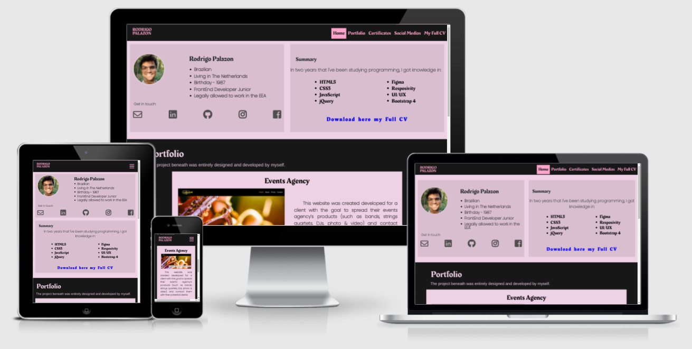

<h1 align="center"> Milestone_project_1 </h1>
<h2 align="center"> Personal Portfolio </h2>

[View the live project here.](https://rodrigopalazon.github.io/milestone_project_1/)

  The main goal of this project is to share with potential employers my knowledge and skills as a programmer. 
  In my web portfolio, you can check my skills, my CV, my Certificates, my social medias, and other projects that I've already done and its source code.
  This whole project was planned,  designed (considering responsivity), and developed by myself. 

## User Experience (UX)
---
- ### User stories 

   - #### First Time Visitor Goals

      1. As a First Time Visitor, I want to easily understand the main purpose of the site and learn more about the programmer whom the portfolio is about and his capabilities.
      2. As a First Time Visitor, I want to be able to easily navigate throughout the site to find content.
      3. As a First Time Visitor, I want to look for different projects created and developed by the programmer that owns the portfolio, their source code, and see if they are trusted, clean and organized. 
      4. As a First Time Visitor, I want to locate his social media links so I can see his behavior and thoughts as a human being, and his personality (beyond technical skills).

    -   #### Returning Visitor Goals

        1. As a Returning Visitor, I want to find a new technical skill presented in his portfolio. This could be a new programming language, a new project that he's done, an open source code that he has been involved in,  an updated CV,  or a new certificate. 
        2. As a Returning Visitor, I want to find the best way to get in contact with the professional with any questions I may have.
        3. As a Returning Visitor, I want to find a better and/or updated presentation of this project.

- ### Design

    -   #### Color Scheme
        
        -   The two main colours used are Code Pink (#EED1E4), and Black (#171717).
    -   #### Typography
        
        -   The Poppins font is the main font used throughout the whole website with Sans Serif as the fallback font in case for any reason the font isn't being imported into the site correctly. Even no being a very much usable font for websites, it was styled properly in size, spacing, weight, and color to be an easily readable font respecting all the UI concepts.

    -   #### Imagery
        -   Imagery is important. The rounded image of the face was designed for the potential employer to have a more clear vision to whom the portfolio belongs.

*   ### Wireframes

    -   Desktop Mockup - [View](assets/images/desktop_wireframe.png)

    -   Mobile Mockup - [View](assets/images/mobile_wireframe.png)

    -   My Full CV Page Mockup - [View](assets/images/cv_page_wireframe.png)

  You can easily recognize that the layout is slightly different from each other, exactly because of the responsivity and how the elements behaves depending on the user size's screen device.
 
 ## Features

-   Responsive on all device sizes

-   Interactive elements
 ## Technologies Used

 ### Languages Used

-   [HTML5](https://en.wikipedia.org/wiki/HTML5)
-   [CSS3](https://en.wikipedia.org/wiki/Cascading_Style_Sheets)
 ---
### Frameworks, Libraries & Programs Used

1. [Bootstrap 4.4.1:](https://getbootstrap.com/docs/4.4/getting-started/introduction/)
    - Bootstrap was used to assist with the responsiveness and styling of the website.
1. [Google Fonts:](https://fonts.google.com/)
    - Google fonts were used to import the 'Titillium Web' font into the style.css file which is used on all pages throughout the project.
1. [Font Awesome:](https://fontawesome.com/)
    - Font Awesome was used on all pages throughout the website to add icons for aesthetic and UX purposes.
1. [jQuery:](https://jquery.com/)
    - jQuery came with Bootstrap to make the navbar responsive but was also used for the smooth scroll function in JavaScript.
1. [Git](https://git-scm.com/)
    - Git was used for version control by utilizing the Gitpod terminal to commit to Git and Push to GitHub.
1. [GitHub:](https://github.com/)
    - GitHub is used to store the projects code after being pushed from Git.
1. [Gimp:](https://www.gimp.org)
    - Gimp was used to create the logo, resizing images and editing photos for the website.
1. [Figma:](https://www.figma.com/)
    - Figma was used to create the Mockups (presented in the Wireframes Section above) during the design process.

## Testing

The W3C Markup Validator and W3C CSS Validator Services were used to validate every page of the project to ensure there were no syntax errors in the project.

-   [W3C Markup Validator](https://validator.w3.org/#validate_by_input) - [Results](assets/images/validator_html.png)
-   [W3C CSS Validator](https://jigsaw.w3.org/css-validator/#validate_by_input) - [Results](assets/images/validator_css.png)

### Testing User Stories from User Experience (UX) Section

-   #### First Time Visitor Goals

   1. As a First Time Visitor, I want to easily understand the main purpose of the site and learn more about the programmer whom the portfolio is about and his capabilities.

      1. Upon entering the site, users are automatically greeted with a clean and easily readable navigation bar to go to the page and/or content of their choice about Rodrigo.
      2. The main page is divided in three parts, being they a Summary CV, Portfolio, and Certificates ( Navigation bar and Footer not considered in this context). 
      3. The user has two options, click the call to action buttons or scroll down, both of which will lead to the same place, to know more about Rodrigo Palazon as a programmer.

   2. As a First Time Visitor, I want to be able to easily navigate throughout the site to find content.

      1. The site has been designed to be fluid and never to entrap the user. At the top of each page there is a clean navigation bar, each link describes what the page or content they will end up at clearly.
      2. At the top of the main page and the "My Full CV" page there is a fixed top navigation bar to ensure the user always has somewhere to go and does not feel trapped as they get to the bottom of the page.
      3. On the "My Full CV" Page, the options in the navigation bar changes, making easier for the user to navigate on this page.
      
   3. As a First Time Visitor, I want to look for different projects created and developed by the programmer that owns the portfolio, their source code, and see if they are trusted, clean and organized. 
     
      1. Once the new visitor has read the Summary CV, they will notice the Portfolio and Certificates sections below.
      2. At the top of any page, the user is able to click on the logo, which will be directing him straight to the top of the Home page.
      3. The visitor can see and inspect Rodrigo's code by clicking at the GitHub links available at the Summary section and Footer. In addition, the GitHub repository for a specific project is available at the Portfolio section, by clicking on the GitHub icon.

   4. As a First Time Visitor, I want to locate his social media links so I can see his behavior and thoughts as a human being, and his personality (beyond technical skills).
      
      1. The user will easily find the social media icons at the Summary Section, and also can scroll to the bottom of any page on the site to locate social media icons in the footer.

   -   #### Returning Visitor Goals

   1. As a Returning Visitor, I want to find a new technical skill presented in this portfolio. This could be a new programming language, a new project that he did, an open source code that he has been involved in, an updated CV, or a new certificate.

      1. This will be recognized in the Summary section when learned a new technical skill be learned.
      2. All the new projects will be added in the Portfolio section.
      3. All new certificates will be added in the Certificates section.

   2. As a Returning Visitor, I want to find the best way to get in contact with the professional with any questions I may have.

      1. The Summary Section clearly highlights the Icons of Email and different Social media, personal and professional.
      2. The footer contains links to the programmer's Email, LinkedIn, GitHub, Instagram and Facebook page.
      3. Whichever link they click, it will be open up in a new tab to ensure the user can get back to the website.

   3. As a Returning Visitor, I want to find a better and/or updated presentation of this project.
      
      1. As Rodrigo progresses in his studies and accomplishments, this website will be updated and improved.

##### Bugs discovered:

  *Here should be added all the bugs and their fixes*

### Deployment:
---

 <!-- ---------------------------------------------------------------------------------- -->
 
### CREDITS: 
---
##### References, Snippets, Tips, Texts, Links and other helps:

    
   1. README: 
      *[Code-Institute-Solutions/SampleREADME](https://github.com/Code-Institute-Solutions/SampleREADME)
      All this READ.md file used the above reference to be created before starting coding.
              
   
   2. Languages, Frameworks, Libraries, and any other tools:
      
      This project was made using:
      
      * [HTML5](https://www.w3schools.com/html/default.asp)
      * [CSS3](https://www.w3schools.com/css/default.asp)
      * [Bootstrap4](https://www.w3schools.com/bootstrap4/default.asp)
      * [Font Awesome](https://fontawesome.com/icons?d=gallery&p=2)
      * [Google Fonts](https://fonts.google.com)
      * [GIMP Photo Editor](https://www.gimp.org/)

   3. Layout and Structure inspiration:
      
      Jack Tomaszewski - Full-Stack Software Engineer.
      https://www.jtom.me

   4. Toggle menu's style:

      https://www.codeply.com/go/4FdZGlPMNV
      Author: Carol Iatek 
      GitHub: https://github.com/iatek  

   5. GIT Conflict issue: 

      On the commits of the May 11, 2021:
         - 19db935
         - eb4cbf5

      I received instructions from the Software Engineer
      (and my personal friend), Ricardo Schiavetti.

      GitHub: https://github.com/rrschiavetti
            
   6. GIT Branches (Create, Merge, and Delete):

      The link beneath was used to  my understanding on the
      how to manage a branch and to create one 'layer' of security and preserve the main branch of the potential mistakes.

      https://www.youtube.com/watch?v=sgzkY5vFKQQ

   7. Collapsible Icon: 
   
      For this, it was used the explanation from the official Bootstrap 4  documentation about **Accordion** as a model, and on it was made the necessary modifications    to achieve the desired result.

      https://www.w3schools.com/bootstrap4/bootstrap_collapse.asp

   8. Show and Hide Elements using jQuery:

      https://www.w3schools.com/jquery/jquery_hide_show.asp

      The example from the official documentation was used as a model to collapse and uncollapse the toggle menu. This solution was chosen because some of the item in the the toggle menu are anchor links to another part from the index.html, making the toggle menu uncollapsable by itself when some item in the menu was clicked.

